# TPG + Geneva Weather · ETL & Visualization Pipeline

This repository contains **Part 1** of the project:

- an **ETL pipeline** to ingest & normalize data from GTFS (timetables), IstDaten (realized trips), and MeteoSwiss (automatic station Geneva–Cointrin),
- the construction of feature datasets:
  - `features_events` (trip-level with delay targets)
  - `features_by_stop_line` (aggregated stop×line bins),
- **Streamlit dashboards** to explore delays and their correlation with weather.

The **gold Parquet files** produced (`data/gold/*.parquet`) are the contract for the modeling repo: **tpg-meteo-ml**, dedicated to ML training and deployment.

---

## 📡 Data Sources (manual download)

The pipeline expects **three families of inputs**. Please download them manually:

### 1. GTFS (Timetables)
- **Source**: [Swiss Open Transport Data – Timetable 2025 (GTFS)](https://data.opentransportdata.swiss/fr/dataset/timetable-2025-gtfs2020)  
- **Content**: Complete timetables for the current year (last version GTFS_FP202x_202x-xx-xx.zip).  
- **Where to place**:  ```data/raw/gtfs/```

---

### 2. IstDaten (Realized trips)
- **Monthly archives**:  
[Monthly archives page](https://archive.opentransportdata.swiss/actual_data_archive.htm)  
→ Download archives from **January of the current year** until the last full month.

- **Daily CSVs**:  
- **Version 1** (IstDaten v1): [IstDaten v1](https://data.opentransportdata.swiss/dataset/istdaten)  
  → **We use only v1** in this project for simplicity and consistency, since it provides the same schema across the full year.  
- **Version 2** (IstDaten v2, started 13 July 2025): [IstDaten v2](https://data.opentransportdata.swiss/dataset/ist-daten-v2)  
  → Not used here (still too recent, not enough history).  

- **Where to place**: ``` data/raw/istdaten```

---

### 3. Meteo (Weather – Geneva Cointrin station, GVE)
- **Station**: Geneva / Cointrin (GVE), automatic weather station  
(richest set of measures: sunshine, humidity, precipitation, pressure, radiation, temperature, wind, etc.).  
- **Resolution**: 10 minutes  
- **Period**: Current year, all values until yesterday  
- **Source**: [MeteoSwiss open data downloader (manual)](https://www.meteosuisse.admin.ch/services-et-publications/applications/ext/telecharger-des-donnees-sans-savoir-coder.html#lang=fr&mdt=normal&pgid=&sid=&col=&di=&tr=&hdr=)  

Steps:  
1. Select **Station = Genève / Cointrin (GVE)**  
2. Choose **10-minute resolution**  
3. Select **Period = current year**  
4. Download the CSV file(s): ``` ogd-smn_gve_t_recent.csv```.  

- **Where to place**:  ``` data/raw/weather```

---

### 📂 Final folder structure (after manual download)
```
data/raw/
├─ gtfs/ # timetable ZIPs
├─ istdaten/ # monthly archives + daily CSVs (v1)
└─ weather/ # MeteoSwiss CSVs for GVE
```

---

## 🔄 Project Pipeline

```mermaid
flowchart TD
    A["GTFS ZIPs<br/>(data/raw/gtfs)"] --> B["01_ingest_gtfs.py"]
    A2["IstDaten CSVs/ZIPs<br/>(data/raw/istdaten)"] --> C["02_ingest_istdaten.py"]
    A3["Meteo GVE CSVs<br/>(data/raw/weather)"] --> D["03_ingest_meteo.py"]

    B --> E["DuckDB warehouse"]
    C --> E
    D --> E

    E --> F["10_build_features.py<br/>(events features)"]
    E --> G["11_build_features_by_stop_line.py<br/>(stop×line features)"]

    F --> H["data/gold/features_events.parquet"]
    G --> I["data/gold/features_by_stop_line.parquet"]

    H --> J["Streamlit dashboards"]
    I --> J
 
```


---

## 📂 Repository structure
```
tpg-meteo-etl/
├─ README.md
├─ requirements.txt
├─ data/
│  ├─ raw/        # dataset downloaded
│    ├─ gtfs/        # manual downloads
│    ├─ istdaten/    # manual downloads (v1)
│    ├─ weather/       # manual downloads
│  ├─ silver/      # intermediate Parquet outputs
│  └─ gold/        # final features parquet files
├─ app/
│  ├─ streamlit_app.py
│  └─ streamlit_by_stop_line.py
├─ src/
│  ├─ common.py
│  ├─ 01_ingest_gtfs.py
│  ├─ 02_ingest_istdaten.py
│  ├─ 03_ingest_meteo.py
│  ├─ 10_build_features.py
│  └─ 11_build_features_by_stop_line.py
└─ data/warehouse.duckdb
```
---
## Usage:

### 1 Install dependencies
```bash
python -m venv .venv && source .venv/bin/activate
pip install -r requirements.txt

```
#### 1.1 Configure environment variables
Create a file `.env` at the project root with the following content (adjust paths if needed):
```bash
# DuckDB
DUCKDB_PATH=data/warehouse.duckdb
DUCKDB_THREADS=8
DUCKDB_MEM=8GB
DUCKDB_CHECKPOINT_THRESHOLD=1GB
DUCKDB_ENABLE_PROGRESS=true

# Logging
LOG_LEVEL=INFO

```
### 2 Initialize warehouse tables
```bash
python src/common.py --init
```
### 3 Ingest raw data
#### 3.1 GTFS (timetables)
```bash
python src/01_ingest_gtfs.py \
  --gtfs data/raw/gtfs/gtfs_fp2025_2025-09-22.zip \
  --db data/warehouse.duckdb \
  --log-level INFO
```
#### 3.2 IstDaten (Realized trips)
```bash
python src/02_ingest_istdaten_v1.py \
  --glob "data/raw/istdaten/*.zip" "data/raw/istdaten/*_istdaten.csv" \
  --db data/warehouse.duckdb \
  --workers 8 --log-level INFO
```
#### 3.3 Weather (MeteoSwiss GVE station)
```bash
python src/03_ingest_weather.py \
  --csv data/raw/weather/ogd-smn_gve_t_recent.csv \
  --db data/warehouse.duckdb \
  --log-level INFO
```

### 4 Build features
#### 4.1 Event-level features
```bash
python src/10_build_features.py --db data/warehouse.duckdb --log-level INFO
```
#### 4.2 Aggregated by stop × line (10-min bins)
```bash
python src/11_build_features_by_stop_line.py --db data/warehouse.duckdb --log-level INFO
```
#### 4.3 Training-ready dataset (rolling medians & weather lags)
Optional
```bash
python src/12_build_feature_training_row.py \
  --db data/warehouse.duckdb \
  --station-id GVE \
  --write-table --replace-table
```
### 5 run dashboards
```bash
streamlit run app/streamlit_app.py

streamlit run app/streamlit_by_stop_line.py
```